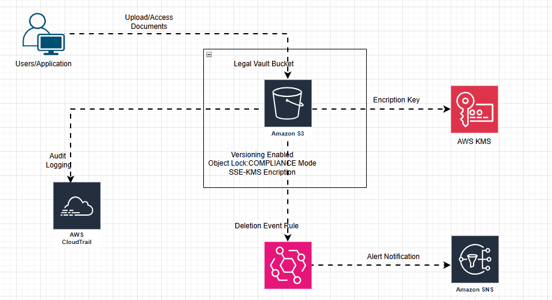

# Immutable Legal Document Vault on AWS

## Description
This project builds an immutable document vault on AWS using Terraform.  
It stores sensitive records in Amazon S3 using Object Lock, versioning, and KMS encryption to prevent tampering or deletion during a defined retention period.  
The system also logs access activity and triggers alerts for risky operations.

---

## Architecture
This solution uses the following AWS services:

- Amazon S3 (Object Lock + Versioning)
- AWS KMS (encryption)
- AWS CloudTrail (audit logging)
- Amazon EventBridge (event detection)
- Amazon SNS (alert notifications)

---

## Architecture Diagram


---

## Use Case
This vault is suitable for regulated environments where documents must remain immutable for compliance reasons.

Examples include:

- financial agreements
- legal contracts
- audit reports
- compliance records

This system ensures:

- documents cannot be permanently deleted during retention
- all access attempts are logged
- data is encrypted
- risky actions trigger alerts

---

## Prerequisites

Install:

- Terraform (v1.5+)
- AWS CLI
- AWS account with appropriate permissions

Configure AWS credentials:

```bash
aws configure

Deployment

Initialize Terraform:
terraform init

Review the plan:
terraform plan

Deploy the infrastructure:
terraform apply

Testing

Upload a test file:
aws s3 cp test.txt s3://your-bucket-name

Attempt deletion:
aws s3 rm s3://your-bucket-name/test.txt
The original object version will remain protected due to Object Lock retention.

Destroy Infrastructure

To remove resources:
terraform destroy

Note:

If Object Lock retention is still active, the bucket cannot be deleted until the retention period expires.
Cost Considerations

```

## 💰 Cost Overview

Typical costs include:

- AWS KMS key (~$1/month)
- Amazon S3 storage
- CloudTrail event logging

For small test workloads, the monthly cost is minimal.

## 🔐 Security Features

- **Immutable storage** enforced with Amazon S3 Object Lock
- **Server-side encryption** using AWS KMS
- **Comprehensive audit logging** through AWS CloudTrail
- **Event-driven security alerts** using EventBridge and SNS
- **Public access fully blocked** to prevent unintended exposure

---

## 📄 License

This project is released under the **MIT License**.
